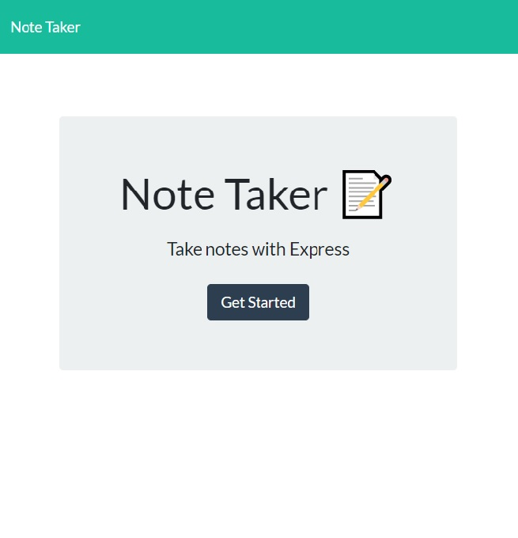
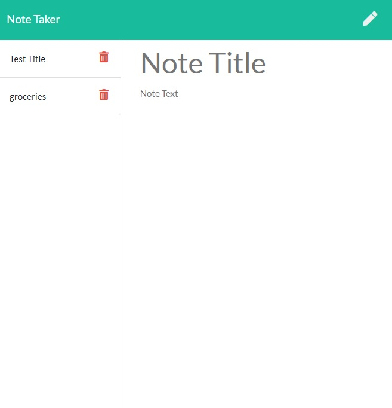

# TheNoteBookTaker

## Table of Contents

1. [Deployed-Application-Link](#Deployed-Application-Link)
2. [Description](#Description)
3. [Usage](#Usage)
4. [Credits](#Credits)
5. [Screenshots](#Screenshots)
6. [Technologies-Used](#Technologies-Used)
7. [Questions](#Questions)

## Deployed-Application-Link
[TheNotebookTaker](https://sheltered-island-38155.herokuapp.com/)

## Description
- This application is creating or deleting notes with using node.js, and express.

## Usage
- You can click on the link given [TheNotebookTaker](https://sheltered-island-38155.herokuapp.com/), and start saving notes or deleting them.

## Credits
- The client side code was given by Trilogy Education Services and the backend code was created by Tolga Secme.

## Screenshots
- 
- 

## Technologies-Used
1. Express
2. Node.js
3. Js
4. HTML:5
5. Css3

##   Questions
- E-mail me for any questions [tolgasecme@icloud.com](mailto:tolgasecme@icloud.com)
- Also you can find me on Github [TolgaS92](https://github.com/TolgaS92).